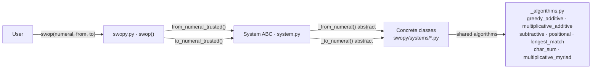

# Code conventions

`swopy` uses the [Google Python Style Guide](https://google.github.io/styleguide/pyguide.html), with the exceptions listed in the `tool.ruff` sections of `pyproject.toml`.

Currently swopy supports numeral systems that are not equivalent to Hindu-Arabic numerals in any script. It is assumed that a future feature to allow translations via the locale is the best implementation to include them.

## Adding a new system

 When adding a new system of numerals:

 1. If it doesn't exist, add a new file to `swopy/systems/` with the name of the script family from which the numeral system comes from
 2. Add a class named after the numeral system to the new file inheriting from the ABC `System`
 3. Implement the abstact method `_to_numeral` to translate from an Arabic number to the new numeral system in the new class
   - use an already existing algorithms from `_algorithms.py` if available
   - If not, implement a new algorithm in `_algorithms.py` if the algorithm is used by more than one subclass of `System` 
   - Implement directly in the new class if the algorithm is not generic
   - Implement passing and failing doctests.
 4. Implement the abstract method `_from_numeral` to translate from the new numeral system to an Arabic number in the new class
   - use an already existing algorithms from `_algorithms.py` if available
   - If not, implement a new algorithm in `_algorithms.py` if the algorithm is used by more than one subclass of `System` 
   - Implement directly in the new class if the algorithm is not generic
   - Implement passing and failing doctests.
 5. Implement the `minimum` and `maximum` class variables, note that they are a `ClassVar` and therefore must maintain the same type spec no matter the type of their value
 6. Implement the variable `_from_numeral_map`
    - `_from_numeral_map` should include both upper- and lower-case variants of a string so that the API will accept both
 7. Implement `_to_numeral_map`, the reverse of `_from_numeral_map`, but only including the most common variant to output a consistent approach to the user
 8. Add the system to the correct location in `docs/references/systems.md`
 9. Register the system in `swopy/systems/__init__.py` and add to `__all__`
 10. Use `noqa: RUF001 RUF002 RUF003` as needed to avoid linting errors
 11. `test_swopy.py` and `test_systems.py` should not be modified to make a single system pass testing. They exist to test the API of all systems.

 ## Docstring formats

 ### Modules

 First line: `"{Script family} numeral system converters."` — one-sentence summary naming the script family.

 Body: Two parts separated by a blank line:

 1. `"This module implements numeral systems from the {script family}."` — one sentence naming the family.
 2. `"Currently supports:"` followed by an indented block (4-space indent) with one entry per class, name left-aligned and Unicode block range right-aligned using spaces:

        ClassName        U+XXXX-U+XXXX

 Then one paragraph per class (or per group of classes sharing an algorithm), describing:
 - The encoding/decoding strategy by name (e.g. "greedy additive", "positional base-7", "multiplicative-additive", "subtractive")
 - Direction if RTL (e.g. "encoding reverses the greedy result, and decoding reverses the input before summing")
 - Any structural quirks: fractions, combining marks, implicit coefficients, omitted coefficients, etc.

 ### System subclass

 First line: `"Implements bidirectional conversion between {number type} and {ClassName} numerals."` — where number type is e.g. "integers", "non-negative integers", "integers and base-12 fractions". Wrap to the next line if the sentence exceeds 88 characters.

 Body: a bullet list of key system facts in this order:
 - `"Uses Unicode block U+XXXX-U+XXXX"` — always first; include the specific code-point subrange or glyph set if relevant (e.g. `"the seven combining digit glyphs"`)
 - `"The system is {algorithm} with {key structural detail}"` — e.g. `"purely additive with dedicated signs for 1, 5, 10, 20, and 100"` or `"positional in base 7, with the most-significant digit written first (left-to-right)"`
 - Additional bullets for any directional or structural quirks (RTL, combining marks, implicit coefficients, omitted coefficients when equal to 1, etc.)

 Optional note paragraph (no heading) for rendering gotchas or distinctions from related systems (e.g. "Distinct from Tamil decimal digits…").

 `Attributes:` section — list every public `ClassVar`:
 
 ```
 minimum: Minimum valid value ({value} or -infinity)
 maximum: Maximum valid value ({value} or +infinity)
 maximum_is_many: True/False — {one-clause reason}
 encodings: UTF-8 only / UTF-8 and ASCII
 ```

 ### Modifying an algorithm

 1. Add a regression test to `tests/test_specifics.py`
 2. Run the profiler
 3. Make the change
 4. If the regression test fails or the profiler is slower revert the change

# Architecture

## What swopy is

A Python library for bidirectional conversion between numeral systems (Roman, Egyptian, Brahmi, Kharosthi, Mayan, etc.) and Arabic integers/fractions.

Public API: `swop(numeral, from_system, to_system)` in `swopy/swopy.py`.
Systems are discovered via `get_all_systems()`.



## System ABC (`swopy/system.py`)

All numeral systems inherit from `System[TNumeral, TDenotation]`:

- `TNumeral` — the string/int/float/Fraction type the system produces/consumes
- `TDenotation` — the Arabic type (int, Fraction, float) the system works with

Key ClassVars set by `__init_subclass__`:
- `_numeral_runtime_type: frozenset[type]` — for `is_valid_numeral()`
- `_denotation_runtime_type: frozenset[type]` — for `is_valid_denotation()`
- `_to_numeral_items: tuple[tuple[Any, Any], ...]` — pre-computed `_to_numeral_map.items()` for hot paths
- `_bounded: bool` — False when min==-inf and max==inf (skips `_limits()`)

Public entry points: `to_numeral()`, `from_numeral()`, and the trusted variants `to_numeral_trusted()` / `from_numeral_trusted()` (skip type guard, called from `swop()` after narrowing).

## Decisions

### Numbers

`bool` is intentionally excluded — `is_valid_denotation(True)` returns False as `bool` is not a number.

### Type checks

Type checks use `type(val) in frozenset` (O(1), no isinstance MRO traversal).

### ClassVars

PEP 526 prohibits `ClassVar` from containing type variables, and PEP 484's invariance rule for mutable bindings means a subclass cannot narrow `Mapping[str, object]` to `Mapping[str, int]` without a type error. As a result

- `System.from_numeral_map` and `System.to_numeral_map` exist as typed accessors for the `from_numeral_map` and `_to_numeral_map` class variables rather than exposing the class variables directly.  Returning the type (`TDenotation`/`TNumeral`) from a classmethod is valid because PEP 695 type parameters on a generic class are resolved through the instance-typed generic machinery introduced in PEP 484.
- When returning a narrowed type in a public method type errors are ignored via `pyright: ignore[reportReturnType]` to avoid unnecessary calls to `System.is_valid_numeral` and `System.is_valid_denotation`.

## Algorithms (`swopy/systems/_algorithms.py`)

Shared algorithms; use these before writing new ones in a system class:

| Function | Used by |
|---|---|
| `greedy_additive_to_numeral(number, items)` | Egyptian, Nabataean, Sinhala, most additive systems |
| `reversed_greedy_additive_to_numeral(number, items)` | RTL systems (ImperialAramaic, Pahlavi, Sogdian) |
| `multiplicative_additive_to_numeral(number, map)` | SinhalaArchaic, Brahmi, Bakhshali |
| `multiplicative_additive_from_numeral(numeral, map, name)` | same systems + Kharosthi |
| `multiplicative_myriad_to_numeral` / `_from_numeral` | Tangut, Khitan |
| `subtractive_to_numeral` / `subtractive_from_numeral` | Roman |
| `longest_match_from_numeral` | Hebrew, Milesian, Apostrophus |
| `char_sum_from_numeral` / `reversed_` | Egyptian, Nabataean |
| `positional_to_numeral` / `positional_from_numeral` | Mayan, Kaktovik, positional systems |

**Hot-path convention:** pass `cls._to_numeral_items` (pre-computed tuple) to `greedy_additive_to_numeral` instead of calling `.items()` on the map each call.

**Arithmetic convention:** use `//` and `%` instead of `divmod()` to avoid built-in call overhead and tuple allocation on hot paths.

## Testing

- `tests/test_systems.py` — property-based (Hypothesis) tests for all systems; **do not modify**
- `tests/test_swopy.py` — integration tests; **do not modify**
- `tests/test_specifics.py` — system-specific and algorithm regression tests; add new tests here
- `tests/profiler.py` — wall-clock + cProfile profiler: `python tests/profiler.py --system roman.Standard --iterations 5000`

Regression test pattern for algorithms: class `TestAlgorithms<Name>` with a `_reference` staticmethod (verbatim copy of the original) and `@given` tests that compare the live function against the reference across multiple systems.

## Performance history

Optimisations applied (in order):
1. `_to_numeral_items` ClassVar — pre-computes `dict.items()` view, passed to `greedy_additive_to_numeral`
2. `frozenset` runtime types — `type(val) in frozenset` replaces `isinstance(..., tuple)`
3. `//` / `%` replace `divmod()` in `multiplicative_additive_to_numeral` and `Kharosthi._to_numeral` — eliminated 300k+ built-in calls, −37% tottime on those functions
4. `//` / `%` replace `divmod()` in `multiplicative_myriad_to_numeral`, `_encode_sub9999`, `Ethiopic._to_numeral`, and `Tamil._to_numeral` — eliminated remaining 300k+ `divmod` calls flagged by profiler
5. String prepend (`result = char + result`) in `positional_to_numeral` — replaces `list` + `append` + `reversed()` + `join`; 700k calls, −61% tottime (0.505s → 0.195s); `list.reverse()` variant tried first and was slower (+7%)
6. Pre-computed `_myriad_sub_mult` ClassVar (Tangut/Khitan/Chinese) + `sub_mult` keyword param in `multiplicative_myriad_to_numeral` — eliminates 300k per-call list comprehensions and closures, −62% tottime (0.189s → 0.071s); `encode_sub` lifted to module-level `_encode_sub_myriad` to remove closure allocation overhead
7. `roman.Standard._to_numeral` uses `cls._to_numeral_items` and `cls._to_numeral_map` directly instead of `cls.to_numeral_map().items()` — eliminates classmethod call overhead, −33% tottime (0.110s → 0.074s); `{method 'items'}` eliminated from profiler top 30
8. `Kharosthi._units_table` ClassVar — pre-computes greedy (4,3,2,1) decomposition strings for 0-9; `_units_str` reduced to a single tuple index lookup; −81% tottime on `_units_str` (0.078s → 0.015s), −42% wall time for Kharosthi (1.68 → 0.98 us/call); module-level `_make_units_table` helper computes the table at class definition time

## Tooling

- `tox -p` — runs all envs in parallel (3.13, 3.14.0, 3.14.3, 3.15.0a7, lint, typecheck, dependencycheck, zizmor)
- Linter: ruff (88-char line limit); formatter: Black via ruff
- Type checker: Pyright
- `noqa: RUF001 RUF002 RUF003` used throughout for Unicode ambiguous characters in numeral maps
